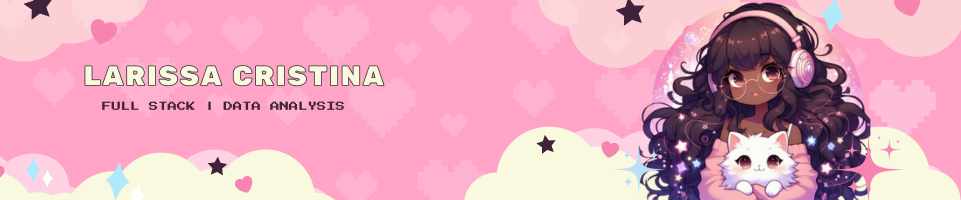

 ##  
 👋 Hi! I’m `@lariiscriis`, welcome to my `GitHub profile` (●'◡'●).

 
   
  

   

- 🎮 Passionate about game development, I love creating immersive worlds and interactive experiences.

- 💻 I work as a full-stack developer, with experience in both **front-end** and **back-end** !

- 🎓 Currently studying **Desenvolvimento de Software Multiplataforma** at FATEC.

- 🌱  I'm also interested in working in the **data field** and exploring opportunities in data analysis!

- ✨ **Pronouns:** She/Her

 

## 

<a href="https://github.com/lariiscriis/Laravel_CRUD">
  <picture>
    <source media="(prefers-color-scheme: dark)" srcset="https://denvercoder1-github-readme-stats.vercel.app/api/pin/?username=lariiscriis&repo=Laravel_CRUD&theme=react&bg_color=0d1117&title_color=fff&border_color=FFA4C7&icon_color=FFA4C7&show_icons=true">
    <source media="(prefers-color-scheme: light)" srcset="https://denvercoder1-github-readme-stats.vercel.app/api/pin/?username=lariiscriis&repo=Laravel_CRUD&theme=moltack&bg_color=FFFFFF&title_color=000000&border_color=FFA4C7&icon_color=FFA4C7&show_icons=true">
    
  </picture>
</a>

## 🛠️ Working with: 

  <table align="center">
    <tr>
        <td align="center">
             
             Java 
        </td>
        <td align="center">
            
             PHP
        </td>
        <td align="center">
            
             C#
        </td>
       <td align="center">
            
             C++
        </td>
        <td align="center">
            
             Javascript
        </td>
         </td>
        <td align="center">
            
             SQL
        </td>
    </tr>
</table>

##  📊 Stats  

<a href="https://github.com/lariiscriis">

## 📲 Connect with me:

  
  

  

